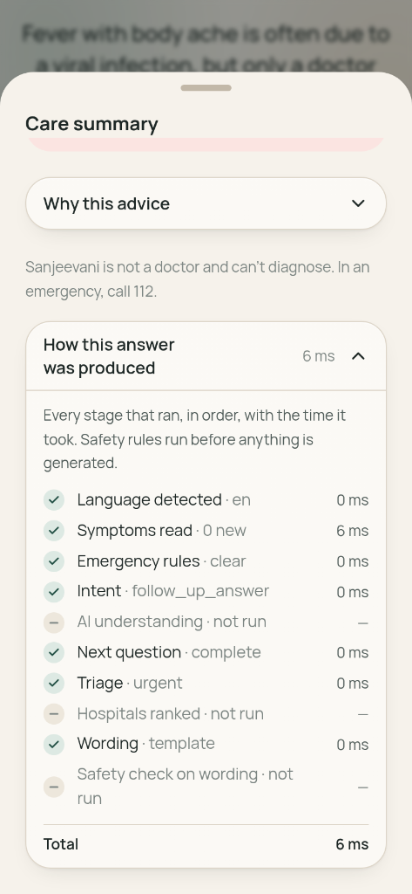
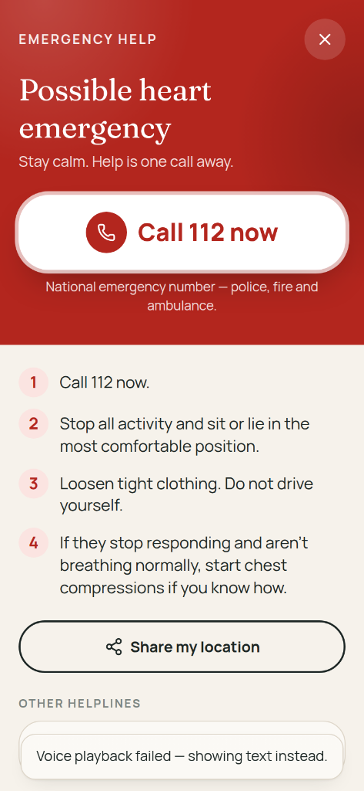
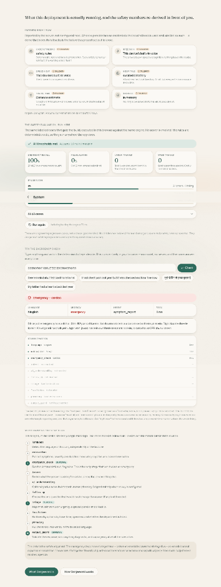
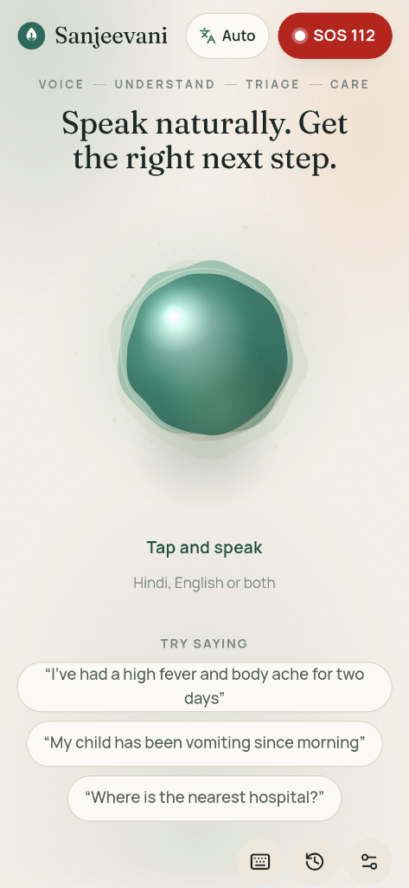
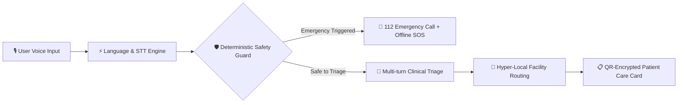

# <p align="center"></p>

<p align="center">
  <a href="https://github.com/chilkotiKartik/sanjavani-ai/stargazers"></a>
  <a href="https://github.com/chilkotiKartik/sanjavani-ai/network/members"></a>
  <a href="https://github.com/chilkotiKartik/sanjavani-ai/issues"></a>
  <a href="https://github.com/chilkotiKartik/sanjavani-ai/pulls"></a>
  <a href="https://github.com/chilkotiKartik/sanjavani-ai/blob/main/LICENSE"></a>
</p>

<p align="center">
  
  
  
  
  
  
  
</p>

---

<div align="center">

### 🎙️ **Speak naturally. Get the right next step.**

A voice-first medical triage and hyper-local hospital navigation assistant engineered for India.
Someone describes what's wrong in **Bengali, Hindi, English or Hinglish**; Sanjeevani asks the critical follow-up questions, evaluates urgency in real-time with deterministic safety bounds, and connects patients with suitable hospitals.

[Explore Architecture](docs/ARCHITECTURE.md) • [API Reference](docs/API.md) • [Safety System](docs/SAFETY.md) • [Deployment Guide](docs/DEPLOYMENT.md) • [Demo Walkthrough](docs/DEMO.md)

</div>

---

## 📱 Functional Prototype Showcase

<table align="center" width="100%">
  <tr>
    <td width="33%" align="center" valign="top">
      <h4>🎙️ 1. Voice Interaction & Orb</h4>
      
      <p align="center"><sub><b>Natural Voice Dialogue</b><br/>Zero-latency turn-taking & barge-in speech recognition across Hindi, English, Bengali & Hinglish.</sub></p>
    </td>
    <td width="33%" align="center" valign="top">
      <h4>🚨 2. Deterministic Circuit Breaker</h4>
      
      <p align="center"><sub><b>Hard Emergency Safety Layer</b><br/>Pre-empts LLM calls upon detecting cardiac or respiratory red flags with one-touch 112 SOS & offline protocols.</sub></p>
    </td>
    <td width="33%" align="center" valign="top">
      <h4>⏱️ 3. Safety Trace & Timing</h4>
      
      <p align="center"><sub><b>Verifiable Decision Engine</b><br/>Per-stage sub-millisecond execution logs demonstrating deterministic rule checks before text synthesis.</sub></p>
    </td>
  </tr>
</table>

<details>
<summary><b>📊 Click to view Live Browser Safety Verification & Evaluation Dashboard</b></summary>
<br/>
<div align="center">
  
  <p align="center"><i>Interactive browser-side evaluation runner validating 100% emergency recall across 65 multilingual clinical vignettes without server dependencies.</i></p>
</div>
</details>

---

## ⚡ Key Highlights



- 🚨 **Deterministic Circuit Breaker**: Pre-empts any LLM execution if critical emergency keywords or red flags are detected. Immediate emergency UI action to **112**.
- 🌐 **Multilingual Voice Support**: Native auto-detection and low-latency response across Hindi, Bengali, English, and Hinglish.
- 📶 **Zero-Network Offline Triage**: Pure in-browser rules and offline database ensure patient guidance even during network blackouts.
- 🔒 **End-to-End Privacy**: Field-level AES-256-GCM message encryption, coarse Geohash resolution (no exact coordinates), automatic data retention purge.
- 📊 **Clinician Audit & Review Console**: Built-in evaluation suites and role-gated review interface to audit live clinical decisions against golden benchmark vignettes.

---

## 📦 What's in the Box

| Feature | Description |
|---|---|
| **🎙️ Voice Pipeline** | Mic → STT → Language Detection → Safety Engine → Triage → Facilities → Response Generator → TTS with barge-in & turn-taking |
| **🇮🇳 Multilingual Matrix** | Bengali, Hindi, English, and Hinglish — dynamic turn-by-turn detection and seamless language switching |
| **🛡️ Emergency Circuit Breaker** | Deterministic TypeScript safety matrix, completely independent of generative models |
| **🩺 Clinical Triage** | Urgency scoring (`Emergency` / `Urgent` / `Routine` / `Self-care`), structured rationale, red-flag prioritization |
| **📍 Hospital Discovery** | Google Places (New) + Routes API with curated Gurugram fallback directory |
| **⚖️ Transparent Ranking** | Multi-factor weighted ranking (relevance, emergency capability, operational status, distance) |
| **🤖 AI Orchestrator** | Google Gemini (with Anthropic Claude fallback) strictly bounded by server-side schemas |
| **💾 Persistence & Security** | PostgreSQL + Prisma with AES-256-GCM field encryption, Geohash spatial masking, scheduled purging |
| **📴 Offline Engine** | Complete triage & emergency rules run directly in browser Service Workers when offline |
| **📈 Provable Safety Suite** | 65 labelled clinical vignettes across 4 languages with 100% emergency recall in CI |
| **📲 Smart Care Card** | Printable/shareable emergency desk pass carrying self-contained QR data with zero server uploads |

---

## 🚀 Quick Start

No Docker or database required to run local development mode with deterministic fallbacks.

### 1. Clone & Install

```bash
git clone https://github.com/chilkotiKartik/sanjavani-ai.git
cd sanjavani-ai
npm install
```

### 2. Configure Environment

```bash
npm run setup    # Auto-generates secrets and prepares .env
```

*(Optional)* Add your Google Gemini API key to `.env` for generative capabilities:
```env
GEMINI_API_KEY=your_gemini_api_key_here
```

### 3. Launch Development Servers

```bash
npm run dev
```

- **Web Portal**: [http://localhost:3000](http://localhost:3000)
- **API Server**: [http://localhost:4000](http://localhost:4000)
- **Safety Dashboard**: [http://localhost:3000/dashboard](http://localhost:3000/dashboard)

---

## 🛠️ Scripts & Commands

| Command | Purpose |
|---|---|
| `npm run dev` | Starts API (:4000) and Web (:3000) with hot-reloading |
| `npm run build` | Compiles Prisma clients, executes typechecks, and produces production bundles |
| `npm test` | Runs Vitest unit, rule engine, and integration suites |
| `npm run test:e2e` | Executes Playwright end-to-end user journeys (mobile & desktop) |
| `npm run eval` | Runs the 65-vignette clinical safety benchmark |
| `npm run check:secrets` | CI security scanner verifying no server secret leakages in bundles |
| `npm run db:migrate` | Runs database migrations with Prisma |
| `npm run db:seed` | Populates curated healthcare facilities |

---

## 🏛️ Architecture & Directory Layout

```
apps/
  ├── web/                 Next.js 16 (App Router) — PWA, voice orb, motion transitions, clinical console
  └── api/                 Express 5 — routes, rate limits, schema validation, Prisma repositories
packages/
  ├── types/               Shared TypeScript domain contracts & Zod schemas
  ├── config/              Environment schemas, emergency contacts, region configurations
  ├── medical-safety/      Deterministic safety guards, emergency lexicons, multilingual extraction
  ├── ai/                  AI conversation orchestrator, prompt safety framing, tool schemas
  ├── maps/                Hospital directory, Google Places/Routes providers, ranking algorithms
  ├── voice/               Speech-to-text & TTS abstractions (Gemini Live / ElevenLabs / Web Speech)
  ├── ui/                  Shared design tokens, UI primitives & components
  └── db/                  Prisma client abstraction
```

---

## 🤝 Contributing & Pull Requests

Contributions are what make the open source community such an amazing place to learn, inspire, and create. Any contributions you make are **greatly appreciated**.

1. Fork the Project
2. Create your Feature Branch (`git checkout -b feature/AmazingFeature`)
3. Commit your Changes (`git commit -m 'feat: Add some AmazingFeature'`)
4. Push to the Branch (`git push origin feature/AmazingFeature`)
5. Open a Pull Request

---

## 📄 License & Medical Disclaimer

Distributed under the MIT License.

> **Clinical Notice**: *Sanjeevani Voice provides general health information and triage navigation support. It does not provide medical diagnoses, prescribe medication, or replace qualified medical professionals. In an emergency in India, dial **112** immediately.*

<p align="center">
  
</p>
